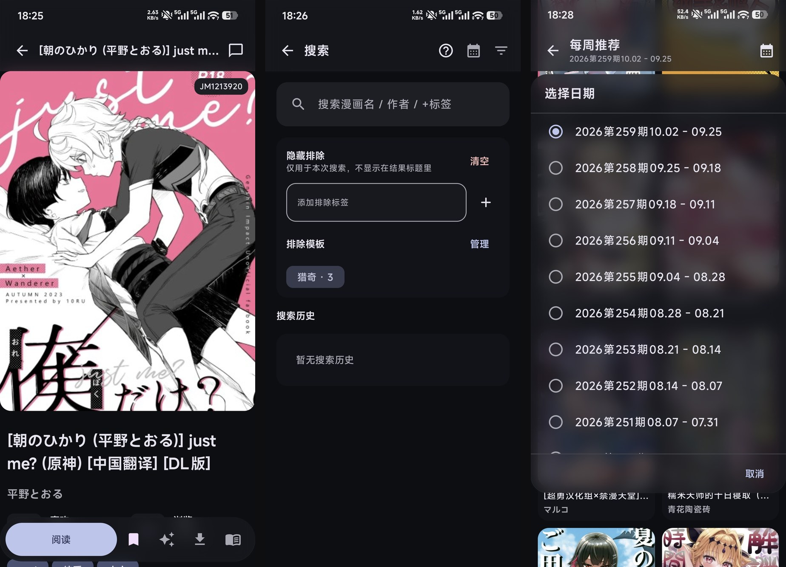
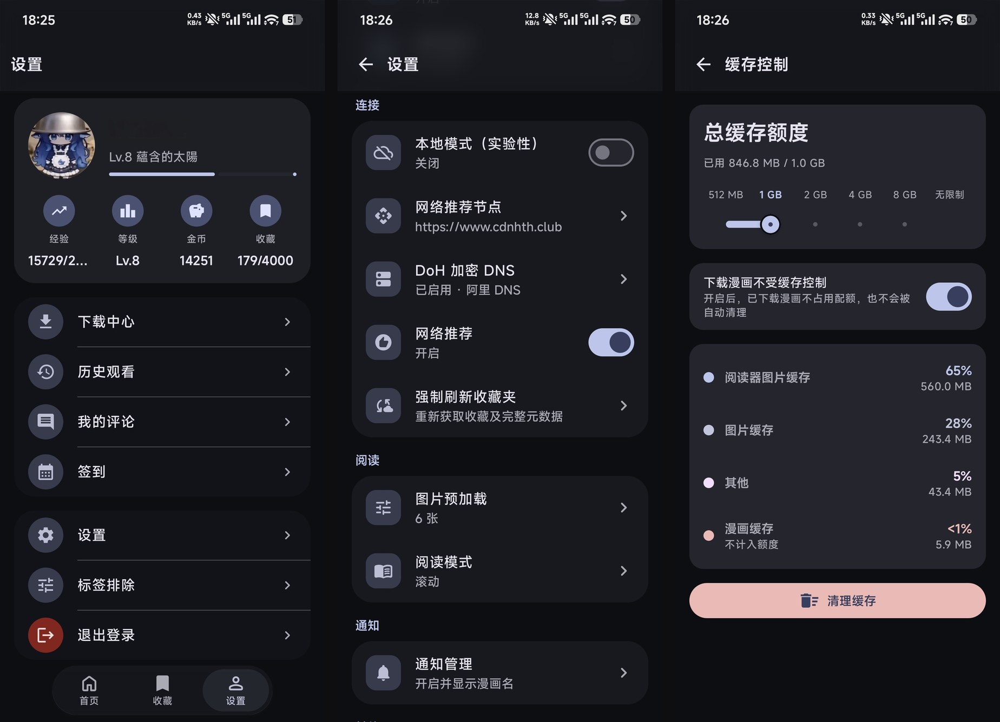

  
  <h1>Kujira-Manga</h1>
  
JMComic（禁漫天堂 / 18comic）第三方 Android 客户端 
  Kotlin + Jetpack Compose + Material 3，四层架构，Room 本地库，Retrofit/OkHttp 网络层，Koin 依赖注入

 

- 系统要求：Android 11（API 30）及以上
- 当前版本：`1.5.0`（versionCode `150`）
- 安装包名：release `kujira.manga`，debug `kujira.manga.debug`
- 站点：[18comic.vip](https://18comic.vip)

---

## 功能特色

  
    
  

---

## 开发

  <a href="AGENTS.md">AGENTS.md</a> ·
  <a href="docs/">docs/</a> ·
  <a href="ARCHITECTURE.md">ARCHITECTURE.md</a> ·
  <a href="CHANGELOG.md">CHANGELOG.md</a>

